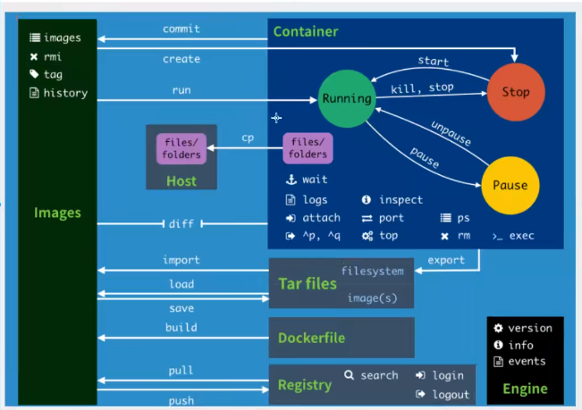

# docker

## 镜像

### 1. 查找镜像

`docker search centos`

### 2. 拉取镜像

`docker pull centos`
> 查看本地镜像 `docker images`

### 3. 删除镜像

`docker rmi $(docker images -q)`删除所有镜像

`docker rmi <REPOSITORY>`删除镜像

## 容器

## 查看已存在的容器

`docker ps -a`

| CONTAINER ID |   IMAGE        |  COMMAND   |    CREATED      |   STATUS            |           PORTS  |   NAMES |
|  ----  | ----  | ----  | ----  | ----  | ----  | ----  |
| 1107b4f91330 |   5d0da3dc9764  | "/bin/bash" |  4 minutes ago  | Exited (130) 4 minutes ago     |    |    myCentOs |

## 运行、进入容器

可以使用`<CONTAINER ID>`也可以使用`<NAMES>`
> 运行容器`docker start <CONTAINER ID>`
> 进入容器 `docker attach <CONTAINER ID>`

### 运行&创建容器

`docker run --name eureka -it <IMAGE ID>`通过镜像创建容器并且运行

`docker run -it -d -p 0.0.0.0:8761:8761 eureka`

- name：指定容器名称
- i：指定容器在启动后以交互的方式运行
- t：分配一个伪 tty 设备（以便您可以直接与远程应用程序进行交互）

### 删除容器

`docker rm $(docker ps -a -q)`删除所有容器

`docker rm <CONTAINER ID>`删除容器